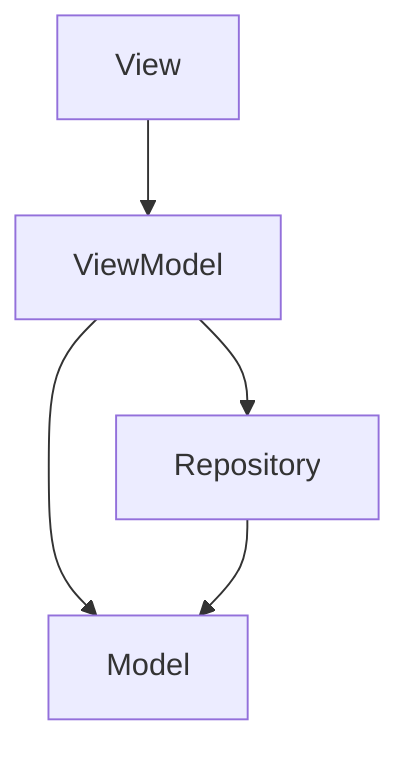
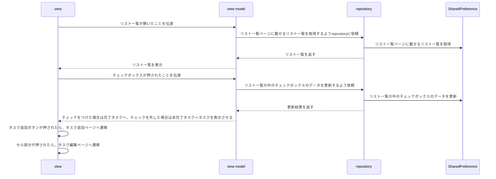
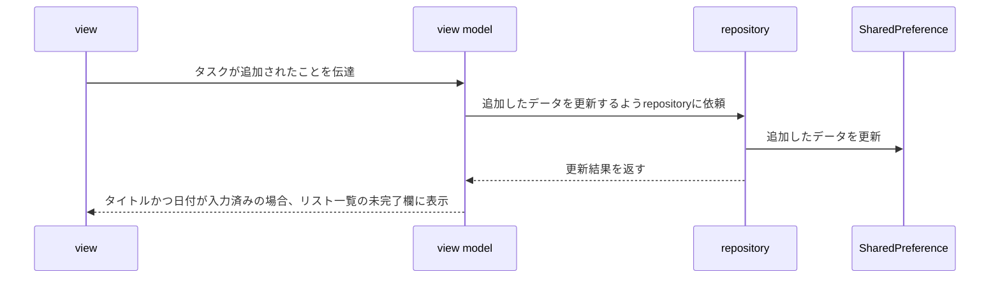
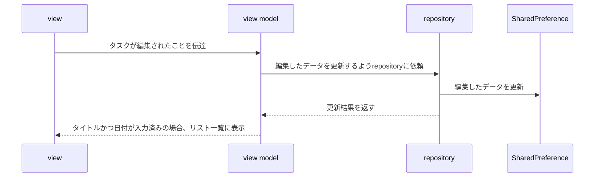

# todo_app

|タスク登録&編集画面|一覧画面|
|--|--|
|||

[apple store url](https://apps.apple.com/jp/app/todo%E7%AE%A1%E7%90%86%E3%82%A2%E3%83%97%E3%83%AA/id6504548526)

# アーキテクチャ図

- MVVMで実装

# シーケンス図
## タスク一覧ページ

## タスク追加ページ

## タスク編集ページ

# 使用技術
- Flutter
- SharedPreference
  - ローカルにデータを保存するために使用
- Riverpod
  - Page全体のプレゼンテーションロジックのために使用
- Flutter Hooks
  - Componentに閉じたプレゼンテーションロジックの表現のみに使用
- Freezed
  - イミュータブルモデルを作るために採用
 
# 気をつけたこと
- チーム開発を意識したプログラミング
  -　変数名の命名も他の人が見てわかりやすいように
  - 要件が単純なアプリのため、シンプルなアーキテクチャを採用
    - その中でも保守性を高めるために最低限の責務分割を実現
  - 作業ごとにブランチをチェックアウトしPRを作成
